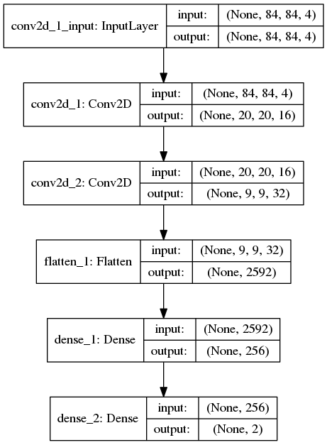

<h1 align="center">
  Solving Flappy Bird with DQN
   
</h1>
<h4 align="center">
  A solution from raw pixels input
   
</h4>

## Content 

* [deepqn.py](deepqn.py) The class implementing the DQN agent and all the 
 functions for the learning and screen processing. 
 
* [main_train.py](main_train.py) The learning script that carries out learning and 
saves the results. 

* [FlappyAgent.py](FlappyAgent.py) The solution file to the challenge. 

* [run.py](run.py) The evalutation script.

## The network architecture

It's the basic architecture from the initial DQN paper. 

  

