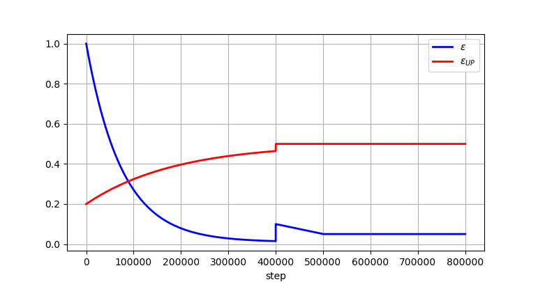
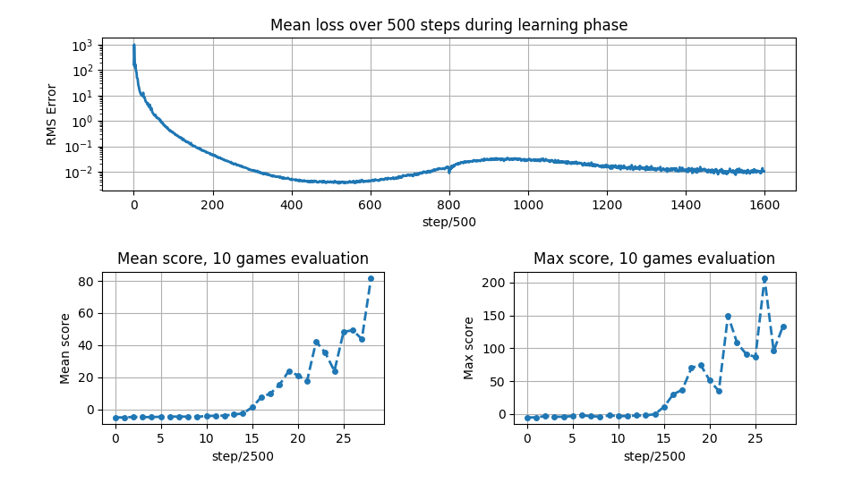

<h1 align="center">
  Solving Flappy Bird with DQN
  <br>
</h1>
<h4 align="center">
  A solution from raw pixels input
  <br>
</h4>

## Content 

* [deepqn.py](deepqn.py) The class implementing the DQN agent and all the 
 functions for the learning and screen processing. 
 
* [main_train.py](main_train.py) The learning script that carries out learning and 
saves the results. 

* [FlappyAgent.py](FlappyAgent.py) The solution file to the challenge. 

* [run.py](run.py) The evalutation script.

## The network architecture

It's the basic architecture from the initial DQN paper. 

<p align="center">
  
</p>
And I used the default initialization kernels and ReLu and linear activation functions.

## The learning parameters

```
mini_batch_size = 32
gamma = 0.99
memory_size = 100000  # size of the memory replay
learning_rate = 1e-5
```
And I used Adam optimizer.

## The learning procedure and results

The learning procedure is done in two phases : 
* A epsilon greedy with exponential decay from 1 to 0.1 to trigger the exploration. 
But if we do uniform action sampling at this point the bird flaps too much and dies by
hitting the upper part of the screen. To palliate to that we defined a probability of
sampling the UP action, epsilon_UP, exponentially increasing from 0.2 to 0.5. By doing 
that, we guarantee that, in the beginning the agent will explore without following always
an ascending motion and dying, and that eventually both actions will be sampled with uniform
probability (guaranteeing that we estimate the two Q-function with same accuracy). 
Another strategy proposed [here](https://github.com/yenchenlin/DeepLearningFlappyBird) uses 
the randomness from the kernel initializations of the network's layers to explore using directly 
an epsilon of 0.1 and a UP probability of 0.5. This last method performs really well and 
gives fast convergence toward optimal policy (scores of 0 around only 100 000 frames). 

* After 400 000 frames with exponential decay the agent understands what he musts do but is still
clumsy (scores around -2) therefore we do a refinement phase with linear decay from 0.1 to 0.05 over
 100 000 frames and then constant 0.05 during 300 000 frames. 
 
The two phases are summarized here : 

<p align="center">
  
</p>

The monitored performances are given here : 

<p align="center">
  
</p>

We see that the convergence is encouraging and that performances keep rising. Hopefully, training
the network longer will yield even higher performances. 
Finally, some bad mouth might say that our first phase is useless and it's only the part starting 
at epsilon equal to 0.1 that is doing the work (like suggested [here](https://github.com/yenchenlin/DeepLearningFlappyBird))

