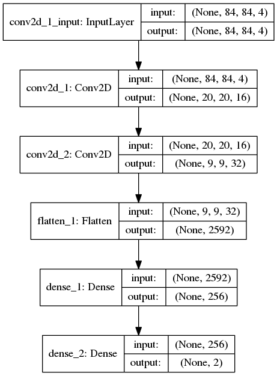

# DQN implementation for the [SUPAERO RL challenge](https://github.com/SupaeroDataScience/RLchallenge)

This repository is a DQN implementation to learn to play [Flappy Bird](https://en.wikipedia.org/wiki/Flappy_Bird)!
The aim of the challenge is to obtain an average score of 15 (pass 20 tubes of the game).

    

## Procedure
First, the screen is:
1. converted in gray scale
2. cropped to remove useless areas of the screen (the ground and what is behind the bird)
3. down sampled to get a final image of size 84x84
 
The process is shown in the following images:

    
    
    

The **state** given to the neural network is a stack of four consecutive screens (to take into account the history of the bird => its velocity). The Neural Network was built with [Keras](https://keras.io/), and has two layers of convolution to extract the features of the state, followed by two dense layers.

    

The DQN parameters used during the learning are the following:
* gamma = 0.95
* learning rate = 1e-5
* the exploration parameters epsilon decreases linearly on the first 200 000 iterations from 0.1 to 0.001
* number total of iteration = 200 000
* batch size at each iteration = 32
* size of the memory buffer = 100 000
* 5000 iterations before starting the learning to pre fill the memory

As said in this [repository](https://github.com/yenchenlin/DeepLearningFlappyBird), the exploration parameters starts at 0.1 to avoid the bird going too much to the top of the screen at the beginning.

Based on the results of this [report](http://cs229.stanford.edu/proj2015/362_report.pdf), a reward model is used to speed up the learning: -1 if the bird dies, 0.1 if it stays alive, 1 if it passes a tube.

## Results 
To monitor the learning, the mean squared error is averaged every 100 iterations (the max is also kept) and saved. Every 25 000 iterations, a performance evaluation is lauched to monitor the score of the neural network. The average and max on 20 games ares saved at this moment. The following curves show these results:

    
    

The final average score is around **110**.

## Discussion
Several remarks can be made:
* The convergence of the mean squared error is not monotonous: it increases beteween 50 000 and 100 000 iterations. An explanation could be the fact that around 50 000 iterations, the bird starts passing the first tube. Thus during the learning, the network starts to see new states which are substantially differents.
* There is a drop of the score at 150 000, that I can't explain. In fact, if the learning continues, the score starts to decrease to reach an average of 0 (as the mean squared error continues to converge). To counteract the drop after 200 000, a solution could be to keep a larger value for epsilon (exploration parameters)
