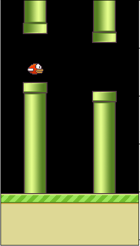
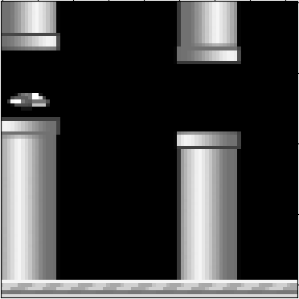

# Solution for the [SUPAERO RL challenge](https://github.com/SupaeroDataScience/RLchallenge)

This repository is a DQN implementation to learn to play [Flappy Bird](https://en.wikipedia.org/wiki/Flappy_Bird)!
The aim of the challenge is to obtain an average score of 15 (pass 20 tubes of the game).

## Procedure
First, the screen is:
1. converted in gray scale
2. cropped to remove useless areas of the screen (the ground and what is behind the bird)
3. down sampled to get a final image of size 84x84
 
The process is shown in the following images:

    
    &#8594;
    

The **state** given to the neural network is a stack of four consecutive screens (to take into account the history of the bird => its velocity). The Neural Network was built with [Keras](https://keras.io/), and has two layer of convolution to extract the features of the state, followed by two dense layers.

The DQN parameters used during the learning:
* gamma = 0.95

    
    

