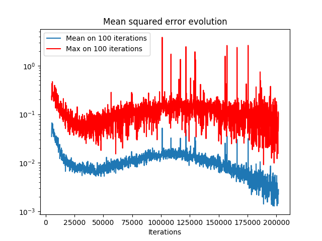
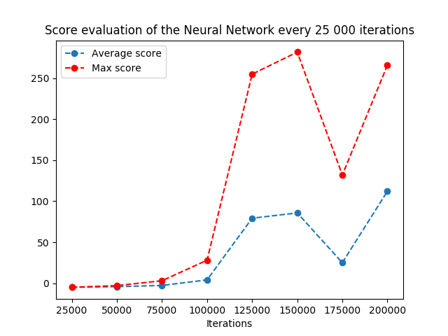

# Solution for the [SUPAERO RL challenge](https://github.com/SupaeroDataScience/RLchallenge)

This repository is a DQN implementation to learn to play [Flappy Bird](https://en.wikipedia.org/wiki/Flappy_Bird)!
The aim of the challenge is to obtain an average score of 15 (pass 20 tubes of the game).

The DQN parameters used during the learning:
* $\gamma = 0.95$

    
    

