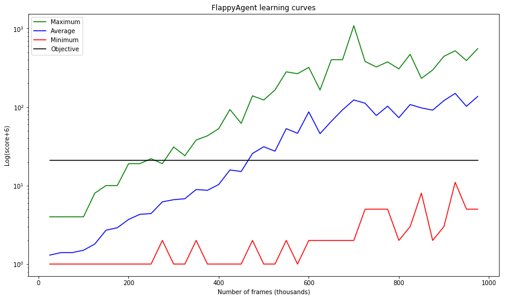

# Deep Q-learning for FlappyBird agent

Implementation of a deep Q-learning method for a pixel-based agent with no prior knowledge.

This work is based on Emmanuel Rachelson's Machine Learning classes (ISAE-Supaéro 2017-2018), alongside [this article](https://www.nature.com/articles/nature14236).

This particular implementation has the following features:
* the agent only chooses how to act every 2 frames, and repeats this action the next frame
* two neural networks are used: the usual one and a target-generating one, with regular (every 2500 frames) weights transfers between the first one and the second one
* training of the network is done every 5 frames for speed of training
* training on minibatches (size: 32 frames)
* replay memory (unlimited)
* initial exploration, then (decreasing) epsilon-greedy actions
* regular backup of the network: ability to choose the best one (based on learning curves)

# Results

Depending on the parameters, the target score of 15 can be reached in less than 200k frames. The proposed solution here took 925k frames for training, but reaches a much better average.

Computation time, including lengthy evaluation periods: 6.5 hours (i7-4790K, GTX770, 16 GiB of RAM)

Over 100 games: average of 116.16, with a maximum of 466.
