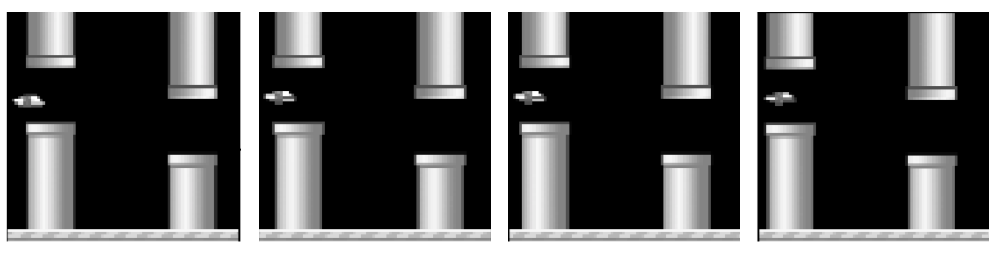

<h1 align="center">
  <br>
  Playing Flappy Bird with DQN
  <br>
  <br>
  <a href=""></a>
  <br>

</h1>

<h4 align="center"> Deep Q Network to learn to play Flappy Bird using Keras</h4>

<p align="center">
  <a href="#context">Context</a> •
  <a href="#installation">Installation</a> •
  <a href="#methodology">Methodology</a> •
  <a href="#code">Code</a> •
  <a href="#parameters">Parameters</a> •
  <a href="#results">Results</a> •
  <a href="#acknowledgments">Acknowledgments</a>
</p>

## Context 

This repo shows how to use **reinforcement learning** to learn to play Flappy Bird. It is a solution to my school challenge [Supaero RL challenge](https://github.com/SupaeroDataScience/RLchallenge). It is important to note that in order to facilitate the learning process the game background is turned to black. The pipe and bird colors have fixed colors (originally the colors change between each game).

## Installation

You will need to install a few things to get started. First, you will need PyGame.
```
pip install pygame
```
And you will need [PLE](https://github.com/ntasfi/PyGame-Learning-Environment) that you can find on the challenge page (It is important that you download it from the challenge page if you want to have the black background and the fixed colors of the pipe and the bird).
```
cd PyGame-Learning-Environment/
pip install -e .
```

## Methodology

The DQN algorithm uses a **convolutionnal neural network** to learn the Q-values of the two actions (flap or not flap) of the game from the screen.
The fist step consist of processing the image. The screen is converted in grayscale and cropped to remove useless areas such as the ground at the bottom and the empty space behind the bird. It is then downsampled to obtain an 84x84 picture.

<p align="center">
    
</p>

In order to capture the velocity of the bird we use a memory of 4 processed screen as state. Here is an example of the input given to the neural network: 

<p align="center">
    
</p>

The channel of the neural network takes into account the correlation in time of the frames. The features are also constructed by doing convolution in space thanks to two convolutionnal layers. The architecture as well as the transfromation of the input image can be summarized as follows:

<p align="center">
    
</p>

## Code 

##### Learning 

To conduct learnings using the code of the repository please read carefully this paragraph. Note that we use **experience replay** to improve learning performances. The replay memory is first initialized using frames sampled from **human experience**. To obtain these frames please run first [extractPolicy.py](extractPolicy.py) and play as many games as you want. Here is the list of files you need to use to conduct tests.

1. [FlappyAgent.py](FlappyAgent.py) -  the **DQN agent**. The learning parameters as well as the keras model are defined here. Please read the documentation of each method to understand how the DQN algorithm has been constructed.
2. [extractPolicy.py](extractPolicy.py) - script used to extract screens coming from games played by users. One must play at least one game to initialize the replay memory. This will save a file ```human_replay.pkl```required in [learn.py](learn.py)
3. [learn.py](learn.py) - the **main** file where the DQN agent learns from games.

##### Testing and Visualizing

1. [run.py](run.py) - test file to evaluate the mean score of the model.
2. [plot_results.py](plot_results.oy) - used to generate the result figures of the readme.
3. [plotly_results.py](plotly_results.oy) - used to create interactive visualization (not really usefull, just for fun :)).
4. [generateGif.py](generateGif.py) - used to create the animation of the readme.

## Parameters

Defining the hyperparameters is a recursive task. Using the advices of the following [repo](https://github.com/yenchenlin/DeepLearningFlappyBird), the learning parameters chosen for the learning are the following :

```
        self.memory = deque(maxlen=100000)
        self.gamma = 0.95  # discount rate
        self.epsilon = 0.1  # exploration rate
        self.epsilon_min = 0.01
        self.epsilon_decay = (0.1 - self.epsilon_min) / 300000
        self.learning_rate = 0.00001
        self.batch_size = 32
  ```

## Results

##### Performances

Learning is performed over 300'000 frames. Every 25'000 iterations 20 games are ran to evaulate the performances of the network. The evolution of the mean/min/max score can be seen in the following figure:

<p align="center">
    
</p>

After 300'000 iterations, a **mean score of approximately 250** is obtained. Note that the evolution of the score during the training is quite surprising. It does not vary monotonously. This means that **training on longer periods does not necessarily yield better scores**. My experience was that I sometimes obtained networks that were able to perform really good after 100'000 iterations but were somehow "unlearning" and reaching negative scores after 200'000 more iterations. It seems that this phenomenon is really sensitive to the exploration. It should not decrease to fast. 

##### Convergence

We can also monitor the average/max mean squared errror of the network over 200 iterations to attest wether the algorithm has converged or not. 

<p align="center">
    
</p>

We reach a mean cost over 200 iterations of approximately 1e-3. The curves suggest that convergence is reached. We should however keep in mind that this training has been done on **only** 300'000 iterations. The **unlearning phenomenom** could be explained by the fact that we simply don't train the network on a sufficiantly long period.

## Acknowledgments

The following repo [Yenchenlin](https://github.com/yenchenlin/DeepLearningFlappyBird) has been a huge source of inspiration.
