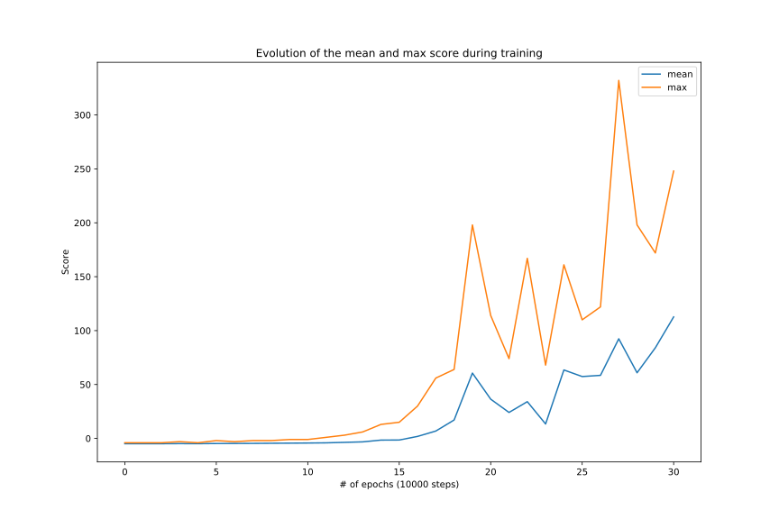

# Approach

We chose to learn an optimal policy directly from the pixels. In order to do this we followed the method described in this [link](https://www.nature.com/articles/nature14236). We used two networks with the same architecture, one usual deep-Q-network and another one to generate the targets, we trasfered the weights from the first one to the second regularly.

We used experience replay with a memory of 350k steps and we trained the network for 500k steps, stopping when we have reached sufficient accuracy (around 170k and 360k steps depending on the initialisation).

# Results

The following image illustrates the evolution of the mean and max score of the agent during the training, it was done on 100 games at the beginning and then only on 10 games when we had reached a cumulative mean score of at least 80 on the last 2 epochs.

On 100 games, our trained Flappy agent can reach a mean score of 116 with a maximum reaching 585!
